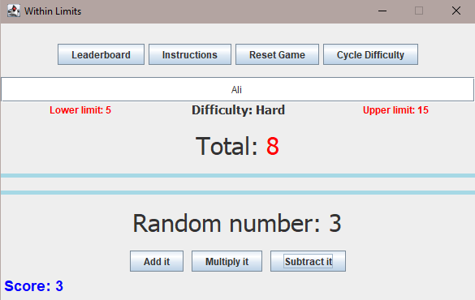

# Java swing math game
Coded following the Model-View-Controller design pattern in Java. Given upper and lower limits, try to keep your total within these limits by performing one operation with the random number and the current total displayed. Scoring is dependant on the difficulty set by the user.

